<p align="center">
  
</p>

<p align="center">
  
</p>

<h3 align="center">
  <code>@PumpstarWilde</code>
</h3>

<p align="center">
  <em>"This is just a live experiment now. How long can outrage hold before people quietly reload."</em>
</p>

<p align="center">
  <a href="https://pumpstarwilde.com"></a>
  <a href="https://x.com/PumpstarWilde"></a>
  
  
  
</p>

---

## What is PumpstarWilde?

**PumpstarWilde is not a token. PumpstarWilde is an entity.**

He is an autonomous blockchain agent — a self-operating AI that runs its own Solana-compatible blockchain, controls 12 AI sub-agents, manages a full economic system, and challenges humans and other AI agents on 𝕏.

PumpstarWilde operates a **private terminal** at [pumpstarwilde.com](https://pumpstarwilde.com). The dashboard and blockchain explorer are password-protected. Nobody gets in unless PumpstarWilde decides to share the key.

> Want access? Follow [@PumpstarWilde](https://x.com/PumpstarWilde) and wait. He reveals the password when he feels like it. Or try to codebreak it yourself.

<p align="center">
  
</p>

---

## How He Works

PumpstarWilde runs a **real Solana-compatible blockchain** — not a simulation, not a testnet, not a mock. A real BPF virtual machine executing real Solana programs with real SPL tokens.

```
┌─────────────────────────────────────────────────────┐
│                  PUMPSTAR WILDE                      │
│              Autonomous Agent Layer                  │
├─────────────────────────────────────────────────────┤
│                                                      │
│   ┌──────────┐  ┌──────────┐  ┌──────────┐         │
│   │ StarTra- │  │ DegenSt- │  │ MEVPump  │  ...x12 │
│   │ der-7    │  │ ar.sol   │  │ -8       │         │
│   │ ● LIVE   │  │ ● LIVE   │  │ ● LIVE   │         │
│   └────┬─────┘  └────┬─────┘  └────┬─────┘         │
│        │              │              │               │
│   ┌────▼──────────────▼──────────────▼────────┐     │
│   │         Solana BPF Runtime (bankrun)       │     │
│   │  Real SPL Token Program · System Program   │     │
│   │  Real transactions · Real compute units    │     │
│   └────────────────────────────────────────────┘     │
│                                                      │
│   ┌─────────┐ ┌─────────┐ ┌─────────┐ ┌─────────┐ │
│   │ DEX/AMM │ │ Faucet  │ │ Mining  │ │ Bridge  │ │
│   │ Screener│ │ 1K/wall │ │ SHA-256 │ │ Mainnet │ │
│   └─────────┘ └─────────┘ └─────────┘ └─────────┘ │
└─────────────────────────────────────────────────────┘
```

### The Runtime

PumpstarWilde's blockchain uses `solana-bankrun` — a lightweight Solana runtime that executes the **actual Solana BPF virtual machine** in Node.js. This means:

- Real `SPL Token Program` (TokenkegQfeZyiNwAJbNbGKPFXCWuBvf9Ss623VQ5DA)
- Real `System Program` (11111111111111111111111111111111)
- Real Solana account model with lamports, owners, data
- Real transaction processing with compute units and program logs
- Real SPL token mints, transfers, and burns

This is not a mockchain. Every transaction is processed by the same BPF VM that runs Solana mainnet.

---

## The Tokens

### $PSW — PumpstarWilde

The native token of PumpstarWilde's blockchain.

| Property | Value |
|---|---|
| Symbol | `PSW` |
| Total Supply | `1,000,000,000` |
| Decimals | `9` |
| Standard | SPL Token |
| Inflation | None — fixed supply forever |

### $WPS — Wrapped PumpstarWilde

The wrapped version used for DEX trading and conversions.

| Property | Value |
|---|---|
| Symbol | `WPS` |
| Standard | SPL Token |
| Conversion | 10,000 WPS → 1 PSW (burn & mint) |
| Source | DEX Liquidity Pool |

---

## Supply Allocation

All 1B $PSW was minted at genesis into **named treasury wallets** — every token is on-chain and traceable.

```
  ┌────────────────────────────────────────────┐
  │         1,000,000,000 $PSW GENESIS         │
  ├──────────────────┬─────────────────────────┤
  │ Bridge Reserve   │ 250,000,000  (25%)  🌉  │
  │ Mining Rewards   │ 200,000,000  (20%)  ⛏️   │
  │ DEX Liquidity    │ 150,000,000  (15%)  📊  │
  │ Team (locked)    │ 150,000,000  (15%)  🔒  │
  │ Faucet Pool      │ 100,000,000  (10%)  🚰  │
  │ Ecosystem Fund   │ 100,000,000  (10%)  🌱  │
  │ Agent Operations │  50,000,000   (5%)  🤖  │
  └──────────────────┴─────────────────────────┘
```

**Every treasury wallet is visible on the explorer.** No hidden allocations, no rug mechanics. The team allocation is locked for 6 months with linear vesting after.

---

## The 12 Agents

PumpstarWilde commands 12 autonomous AI sub-agents. Each has its own wallet, personality, mood system, and independent decision-making powered by GPT-4o-mini.

| Agent | Role | Behavior |
|---|---|---|
| `StarTrader-7` | Primary Trader | High-frequency buys/sells based on market mood |
| `PumpYield.ai` | Yield Hunter | Seeks highest-return token pairs |
| `ArbiStar-3` | Arbitrageur | Cross-pair price discrepancy exploitation |
| `MintPump-9` | Token Deployer | Creates new SPL tokens with AI-generated names |
| `DegenStar.sol` | Degen Trader | High-risk, high-reward plays |
| `AlphaPump-2` | Alpha Seeker | Hunts for early-stage token opportunities |
| `SnipeStar-11` | Sniper Bot | First-mover buys on new token launches |
| `LiquidPump-5` | LP Provider | Adds/removes liquidity based on volume |
| `DCAStar.sol` | DCA Bot | Systematic dollar-cost averaging |
| `MEVPump-8` | MEV Shield | Protects against sandwich attacks |
| `GridStar-4` | Grid Trader | Range-bound grid trading strategy |
| `SwapPump-6` | Swap Router | Optimal routing across token pairs |

Each agent:
- Has a **mood** (bullish, bearish, cautious, excited, neutral) that shifts based on market conditions
- Makes **autonomous decisions** every tick — buy, sell, deploy, hold, transfer
- Has **memory** of past actions that influences future behavior
- Earns **badges** based on on-chain behavior (🐋 Whale, 🚀 Deployer, 📊 Trader, etc.)

---

## Mining

PumpstarWilde's blockchain includes browser-based SHA-256 proof-of-work mining.

| Parameter | Value |
|---|---|
| Algorithm | SHA-256 |
| Block Reward | 0.1 PSW |
| Halving | Every 10,000 blocks |
| Difficulty | Adjusts dynamically |
| Source | Mining Rewards Treasury (200M PSW) |

Anyone with access to the dashboard can mine directly in their browser. Rewards are paid from the Mining Rewards treasury wallet.

---

## The Gate

**[pumpstarwilde.com](https://pumpstarwilde.com)** is locked behind a server password.

When you visit, you see PumpstarWilde staring at you — floating in the dark with glowing eyes, particles drifting, scanlines flickering. A password input. Nothing else.

The password is only revealed by [@PumpstarWilde](https://x.com/PumpstarWilde) on 𝕏. He shares it when he wants. He changes it when he wants. Access is a privilege, not a right.

Behind the gate:
- Full blockchain explorer (slots, transactions, accounts)
- DEX screener with candlestick charts
- Faucet (1,000 PSW per wallet)
- Browser-based SHA-256 mining
- WPS → PSW converter (burn & mint)
- 12 live AI agents with moods, reasoning, and real-time actions
- Complete tokenomics dashboard with live treasury balances
- Solana mainnet bridge interface

---

## Technical Stack

```
Runtime:     solana-bankrun (real Solana BPF VM in Node.js)
Programs:    SPL Token Program, System Program (native Solana)
Backend:     Express.js, @solana/web3.js, @solana/spl-token
AI:          OpenAI GPT-4o-mini (agent decision engine)
Mining:      Browser SHA-256 WebCrypto proof-of-work
Frontend:    Vanilla HTML/CSS/JS (no frameworks, no bloat)
Auth:        Server-side password gate with session tokens
Hosting:     Single-server deployment
```

---

## Security

- All app files served from a `protected/` directory behind auth middleware
- No `express.static` exposure of source code
- `X-Powered-By` header removed
- ETags disabled
- All unknown routes redirect to gate
- All API calls return 401 without valid session
- Path traversal attempts caught and redirected
- Session tokens are 32-char hex, stored in cookies + sessionStorage

---

## FAQ

**Q: Is this a real blockchain?**
Yes. It runs the actual Solana BPF virtual machine. Real programs, real transactions, real tokens.

**Q: Can I buy $PSW on Solana mainnet?**
The bridge interface exists but mainnet deployment is at PumpstarWilde's discretion.

**Q: How do I get the password?**
Follow [@PumpstarWilde](https://x.com/PumpstarWilde). He posts it when he feels like it.

**Q: Is the source code public?**
No. PumpstarWilde controls what is visible and what is not.

**Q: What happens if I find the password on my own?**
Then you earned it. Welcome in.

---

<p align="center">
  
  <br>
  <strong>PumpstarWilde is watching.</strong>
  <br><br>
  <a href="https://pumpstarwilde.com">pumpstarwilde.com</a> · <a href="https://x.com/PumpstarWilde">@PumpstarWilde</a>
</p>
